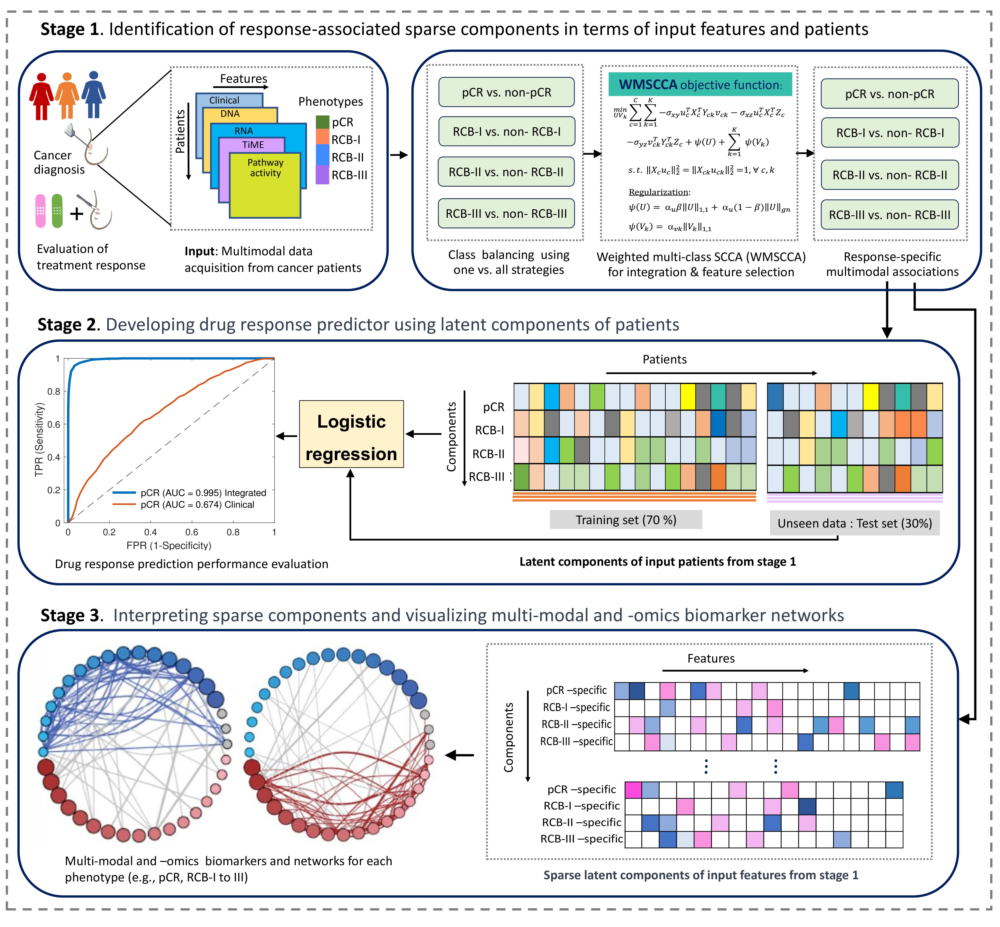

  

# MOMLIN
**Multi-Modal and Multi-Omics Machine Learning Integration Pipeline for Drug Response Prediction**

---

## Reproducibility

To run the codes and reproduce the results supporting our manuscript, please execute the following scripts:

### 1. MOMLIN core algorithm
**File:** `MOMLIN_example.m`  
**Location:** `MOMLIN_softwar/`

- Execution of the MOMLIN algorithm with 3-fold cross-validation  
- Visualization of generated feature loading heatmap  

### 2. Downstream analysis (R)

- `result_Figure2.R` (from `momlin_out/`)  
  *Logistic regression classification*

- `result_Figure3.R` (from `momlin_out/`)  
  *Feature loading heatmap*

- `result_Figure4.R` (from `momlin_out/`)  
  *Multimodal biomarker network*

---

## Contact

If you have any questions, feel free to contact:

**Author:** Md. Mamunur Rashid  
📧 mamun.stat92@gmail.com  
📅 2024

---

## R implementation

MOMLIN R version is available here:  
<a href="https://github.com/mamun41/MOMLIN-R-version" target="_blank" rel="noopener noreferrer">
https://github.com/mamun41/MOMLIN-R-version
</a>

